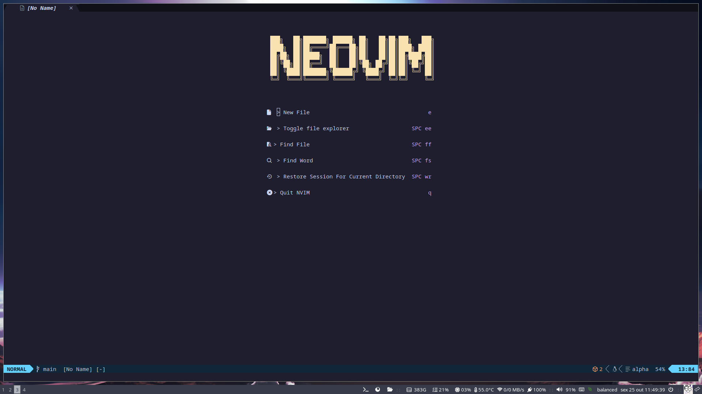
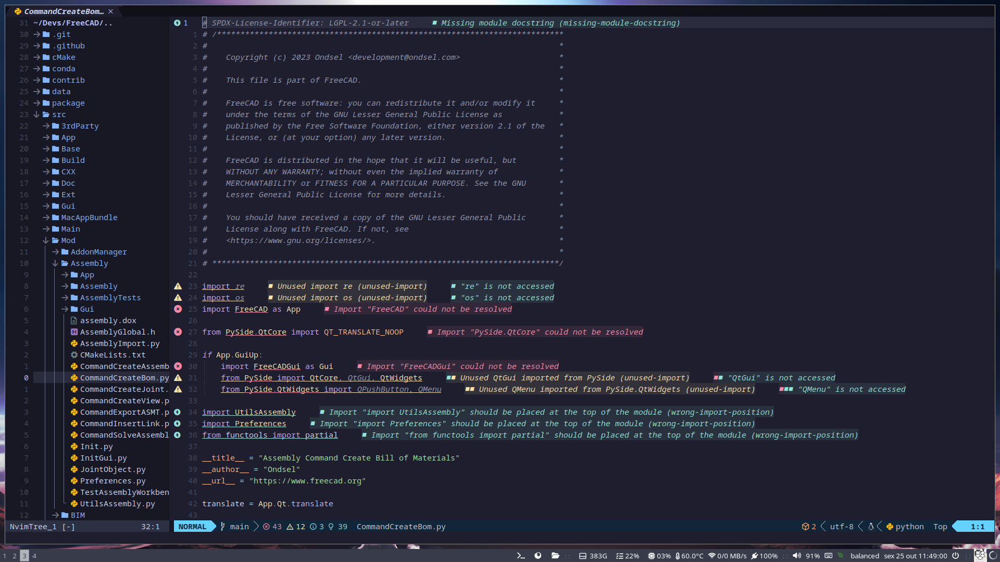

# MyNvim

<div style="display: flex; justify-content: space-around;">
    
    
</div>

## What is MyNvim?

MyNvim is a comprehensive configuration setup for Neovim, designed to provide an optimized and perfect editing experience.

## How to Install

### Linux

Before installing, run the following commands to remove any old Neovim configurations:

```bash
rm -rf ~/.local/share/nvim/*
rm -rf ~/.local/state/nvim/*
rm -rf ~/.config/nvim/*
```

Next, install the new configuration:

```bash
cd ~/.config/nvim
git clone https://github.com/gitalexcampos/ultimate-nvim.git ./
```

## Test Your New Neovim Setup

To test your new configuration, simply run:

```bash
nvim
```

## Features

- Comprehensive plugin management
- Enhanced performance settings
- Custom keybindings
- Improved user interface

# Keybindings Overview

## Number Management

| Shortcut       | Functionality      |
| -------------- | ------------------ |
| `(Espace) + k` | Increment a number |
| `(Espace) + j` | Decrement a number |
| `(Espace) + +` | Increment a number |
| `(Espace) + -` | Decrement a number |

## Tab Management

| Shortcut          | Functionality                  |
| ----------------- | ------------------------------ |
| `(Shift) + n`     | Create new tab                 |
| `(Shift) + Right` | Move current tab to right      |
| `(Shift) + Left`  | Move current tab to left       |
| `(Shift) + l`     | Go to next tab                 |
| `(Shift) + h`     | Go to previous tab             |
| `(Shift) + x`     | Close current tab              |
| `(Shift) + c`     | Open current buffer in new tab |

## Window Management

| Shortcut         | Functionality               |
| ---------------- | --------------------------- |
| `(Ctrl) + =`     | Make splits equal size      |
| `(Ctrl) + x`     | Close current split         |
| `\|`             | Make a Vsplit               |
| `_`              | Make a Hsplit               |
| `(Ctrl) + k`     | Move cursor to up window    |
| `(Ctrl) + j`     | Move cursor to down windows |
| `(Ctrl) + l`     | Move cursor to left window  |
| `(Ctrl) + h`     | Move cursor to right window |
| `(Ctrl) + Up`    | Resize window to up         |
| `(Ctrl) + Down`  | Resize windows to down      |
| `(Ctrl) + Left`  | Resize window to left       |
| `(Ctrl) + Right` | Resize window to right      |

## File Management

| Shortcut        | Functionality                   |
| --------------- | ------------------------------- |
| `(Espace) + ff` | Fuzzy find files in cwd         |
| `(Espace) + fr` | Fuzzy find recent files         |
| `(Espace) + fs` | Find string in cwd              |
| `(Espace) + fc` | Find string under cursor in cwd |

## File Explorer Management Tree

| Shortcut        | Functionality                        |
| --------------- | ------------------------------------ |
| `(Espace) + ee` | Toggle file explorer                 |
| `(Espace) + ef` | Toggle file explorer on current file |
| `(Espace) + ec` | Collapse file explorer               |
| `(Espace) + er` | Refresh file explorer                |

## Session Management

| Shortcut        | Functionality                          |
| --------------- | -------------------------------------- |
| `(Espace) + wr` | Restore session for cwd                |
| `(Espace) + ws` | Save session for auto session root dir |

## Git Management

| Shortcut       | Functionality |
| -------------- | ------------- |
| `(Espace) + g` | Open LazyGit  |

## Miscellaneous

| Shortcut        | Functionality             |
| --------------- | ------------------------- |
| `(Espace) + sm` | Maximize/minimize a split |

## Acknowledgments

This project is based on the setup guide by [Josean](https://www.josean.com/posts/how-to-setup-neovim-2024). Thank you for the valuable insights!

Feel free to explore and customize it further to suit your needs!
